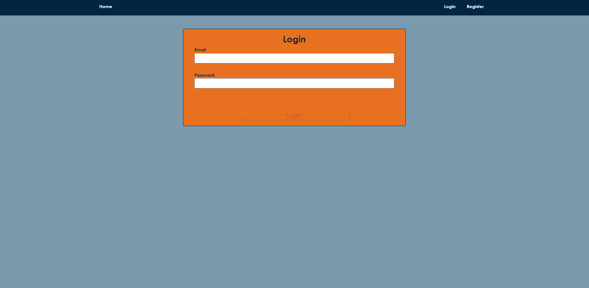
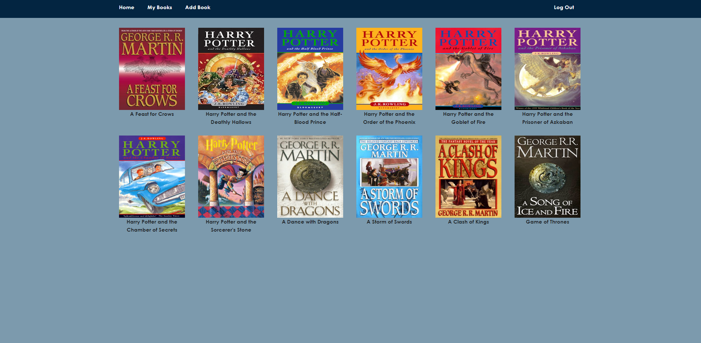
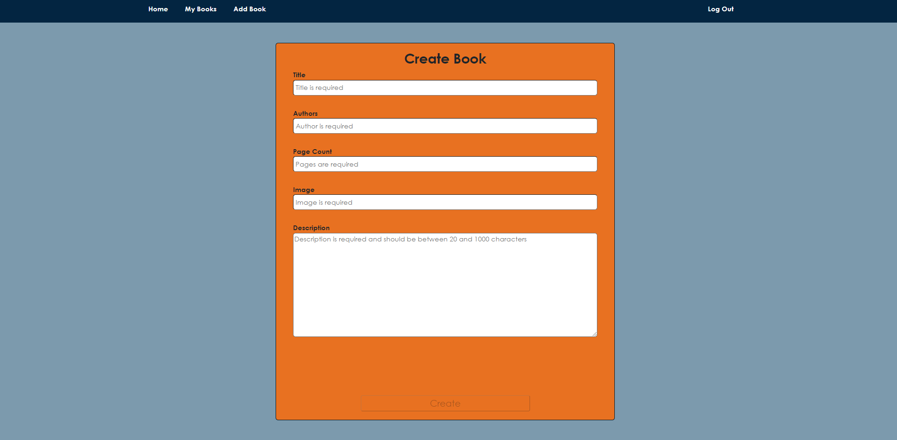
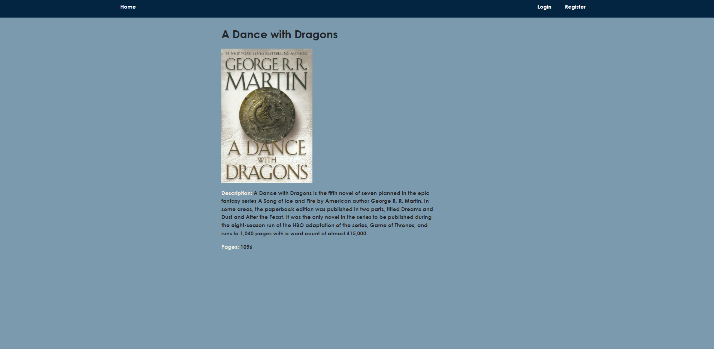
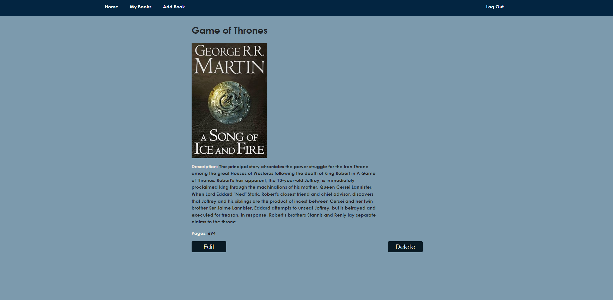

# Book Catalog

Book Catalog is an Angular app designed for users to share books. It utilizes Angular version 16 and MongoDB.

## Getting Started

### To run the server, navigate to the following directory:
 Your Drive:\Book-Catalog-Angular\Book-Catalog\server> npm install
 Your Drive:\Book-Catalog-Angular\Book-Catalog\server> npm start

### To run the client, navigate to the following directory:
 Your Drive:\Book-Catalog-Angular\Book-Catalog\src> npm install
 Your Drive:\Book-Catalog-Angular\Book-Catalog\src> npm start

 ### To run the tests, navigate to the following directory:
 Your Drive:\Book-Catalog-Angular\Book-Catalog> npm test

## User Interface Overview

Non logged in users can see all books and their details.
After registration and logging in users can create books and edit/delete their own books.

## Here is how Book Catalog looks:
Register

Login

Home

Add Book

Details-one

Details two

